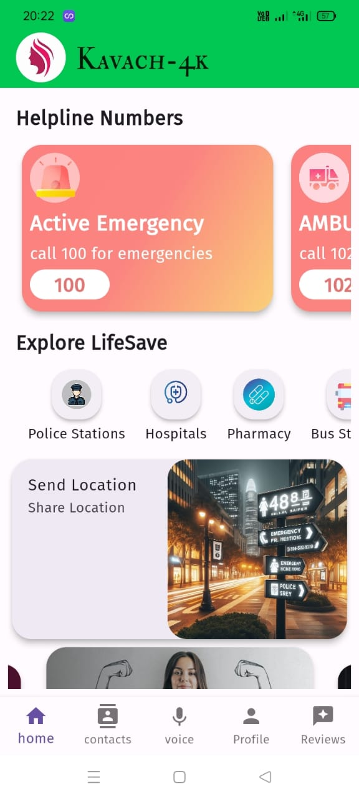
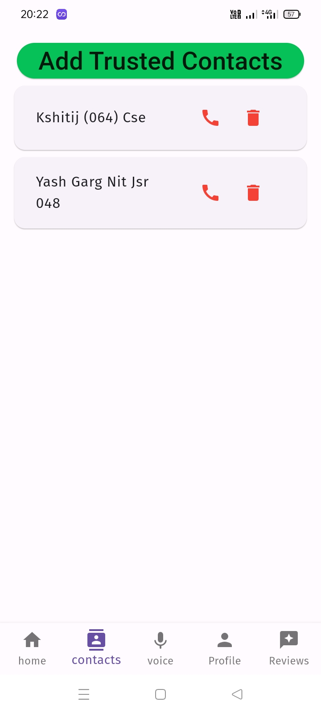
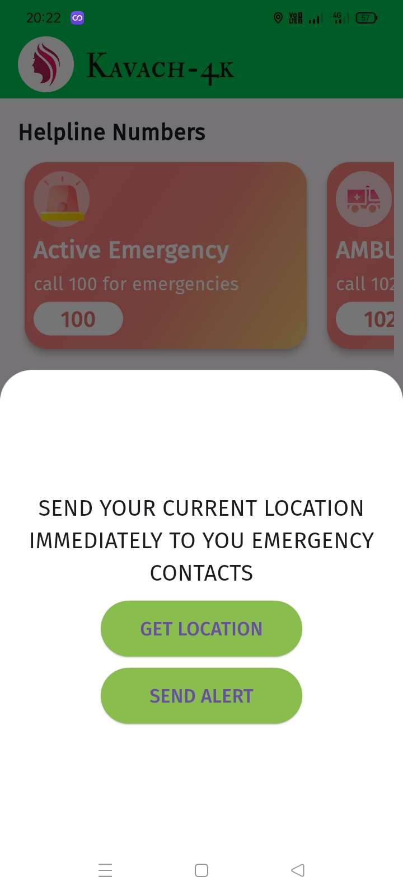
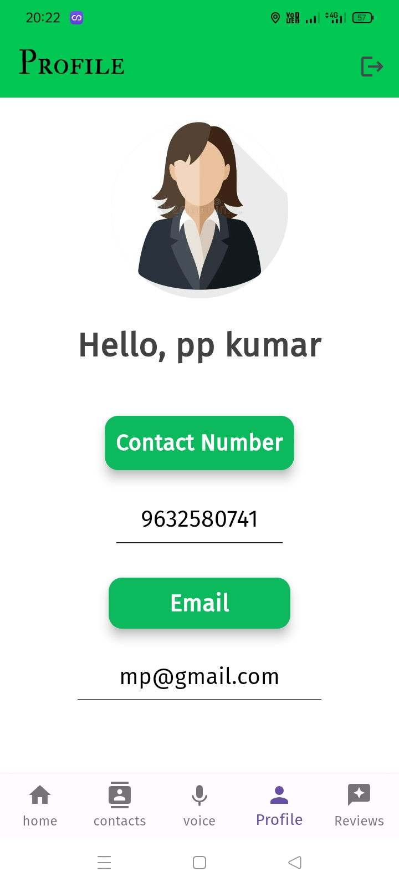
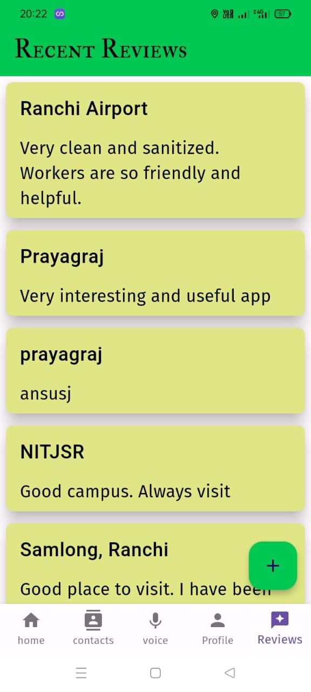

# Kavach-4K

Introducing Kavach-4k, an innovative mobile application designed to enhance the safety of women during solo travel, especially in isolated or unfamiliar surroundings. The app's standout feature is the "Scream Alert" functionality, automatically triggering an emergency alert when a girl screams, ensuring prompt assistance even in challenging situations. This discreet feature sends both a distress message and the user's precise location to pre-saved contacts, fostering a swift response network for real-time safety. With a user-friendly interface, seamless emergency contact management, and integration with Google Maps, Kavach-4k empowers users to locate nearby facilities quickly. The app's commitment to community engagement is evident through features allowing users to share experiences, providing valuable tips for staying vigilant. The streamlined registration process ensures accessibility, making Kavach-4k more than just an app; it's a holistic safety companion fostering a connected and vigilant community dedicated to women's security.

<!-- # Screenshots

 -->

# Mockups

    
    
    
    
    
    

Project Name - Kavach-4k:

The app is aptly named Kavach-4k, signifying a modern, comprehensive shield for women's safety during solo travel.
Merges advanced technology with practical features to create a powerful safety companion.

## Features:

### 1. Easy Registration and Login:
- Simplifies the onboarding process by requiring only the user's name and phone number for registration.
- Ensures accessibility and user-friendliness for a wide range of users.

### 2. Quick Police Call Button:
- Offers a dedicated button for an immediate call to the police with pre-programmed emergency numbers.
- Eliminates the need for users to remember or manually dial emergency contact numbers.

### 3. Location Tracking
- Integrates Google Maps functionality for users to easily locate nearby hospitals, police stations, bus stands, and pharmacies.
- Enhances situational awareness and aids in making informed decisions during travel.

### 4. Emergency Contacts Management:

- Users can save and manage emergency contacts directly within the app.
- Provides a quick and efficient way to notify friends, family, or trusted individuals during emergencies.

### 5. Send Alert Button:
- Allows users to manually send distress signals and their current location to chosen contacts.
- Provides an additional layer of control for users in urgent situations.

### 6. Shake for Help:
- Women can trigger an emergency alert by shaking their phone.
- Sends an alert message and the user's location to pre-saved contacts within the app.

### 7. Send Scream Alert 
- The app initiates an emergency alert when detecting a girl's scream.
- It promptly sends both the distress message and her location to pre-saved contacts for immediate assistance.

### 8. Alert Beep Functionality:
- In instances where the user's sound is accurately recognized as being in danger, the app emits a high-frequency sound.
- This can help scare away the person causing trouble and let nearby people know that someone needs help.

### 9. User Reviews and Tips:
- Facilitates a community-driven platform where users can share reviews and insights about their travel experiences.
- Encourages a supportive network and provides valuable tips on staying alert in new locations.

## Installation and Setup

- Clone the repository:
git clone https://github.com/abhik813/kavach-4k
- Navigate to the project directory:
cd kavach-4k
- Install dependencies:
flutter pub get
- Run the app:
flutter run

Please make sure you have Flutter and Dart SDK installed on your machine before running the app.

## Requirements

- Flutter SDK
- Dart SDK
- Android Studio / Xcode (for simulators or physical devices)
- Internet connectivity (for real-time location tracking and emergency notifications)

## Download Kavach-4k
- Kavach-4k: https://drive.google.com/file/d/16SRjAZHAe1lvQiwcxUDhTOvWWQbSD0ml/view?usp=sharing

## Contributing

Contributions are welcome! If you have any ideas, bug reports, or feature requests, please open an issue or submit a pull request. Make sure to follow the code style and guidelines mentioned in the project.
